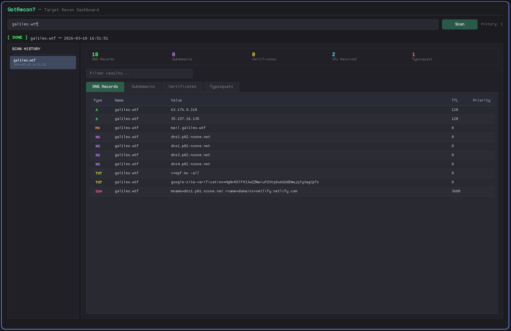

# GotRecon?

A target reconnaissance dashboard built with Electron. Enter a domain and get a consolidated view of DNS records, certificate transparency logs, subdomains, and potential typosquat domains.



## Features

- **DNS Resolution** — Queries all common record types (A, AAAA, MX, TXT, NS, CNAME, SOA, etc.)
- **Certificate Transparency** — Pulls certificates from crt.sh and extracts associated subdomains
- **Subdomain Discovery** — Enumerates subdomains via CT logs and resolves their IPs
- **Typosquat Detection** — Generates domain permutations and checks which ones are registered
- **Scan History** — Keeps previous scan results for quick reference
- **Filterable Results** — Search and filter across all result tabs

## Requirements

- [Node.js](https://nodejs.org/) (v18+)
- npm

## Setup

```bash
npm install
```

## Usage

```bash
# Start the app (Wayland)
npm start

# Start the app (X11)
npm run start:x11
```

Not running Wayland or X11? Fix it yourself, I don't care.

Enter a domain (e.g. `example.com`) in the input field and click **Scan**.

## Build

```bash
npm run build
```

Produces platform-specific packages (AppImage on Linux, DMG on macOS, NSIS installer on Windows).

## Install (Arch Linux)

```bash
sudo bash install-arch.sh
```

Installs to `/opt/gotrecon`, creates a desktop entry, and adds a `gotrecon` launcher to your PATH that auto-detects Wayland/X11.

To uninstall:

```bash
sudo bash /opt/gotrecon/uninstall.sh
```

## Project Structure

```
main.js            Electron main process
preload.js         Context bridge (IPC)
renderer/
  index.html       App shell
  app.js           UI logic
  style.css        Styles
modules/
  dns.js           DNS record queries
  crtsh.js         crt.sh certificate transparency lookups
  subdomain.js     Subdomain enumeration & IP resolution
  typosquat.js     Typosquat generation & checking
```

## License

GPL-3.0 License. See [LICENSE](LICENSE) for details.
